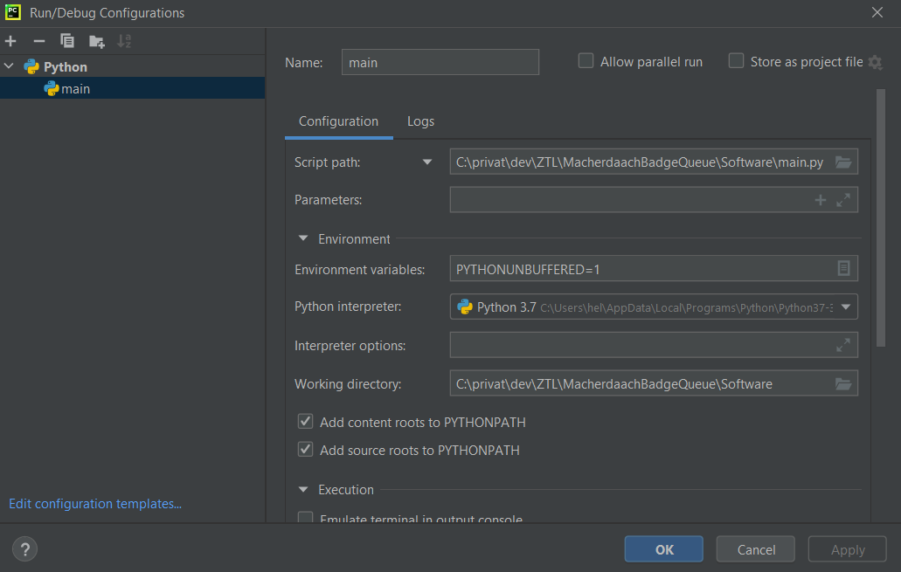

# MacherdaachBadgeQueue

This repo houses the Lötplatz-Zuweisungssystem for the Macherdaach 2021 in Landau, hosted by [ZTL](https://ztl.space/). 

## Getting started

1. Checkout the repo via ```git clone``` 
2. Get the MQTT-config file to access the mqtt broker
   1. Contact: [Casartar](https://github.com/casartar) or [JohnnyMoonlight](https://github.com/JohnnyMoonlight)
3. Initialize with your favourite IDE
   1. Sample configuration for [PyCharm](https://www.jetbrains.com/help/pycharm/quick-start-guide.html): 
   2. ...

## Sample MQTT Messages

### New user has arrived at place one and starts soldering

```
{
  "place_number": 1,
  "place_occupied": true
}
```

### User has finished soldering

```
{
  "place_number": 1,
  "place_occupied": false
}
```

### Place new ticket number in queue
```
{
  "new_number":1
}
```

## Properties to access view

These properties in the package view are responsible for displaying information in the gui.

